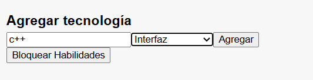
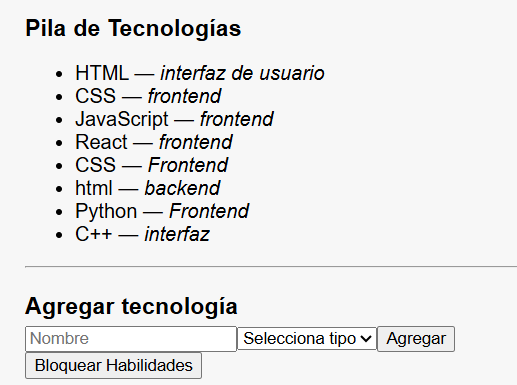
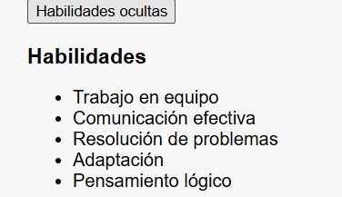
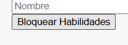

# CV React - Carlos Herrera (v08)

Evidencia: GA1-220501096-03-AA1-EV08 – Eventos y estado local en React – CV dinámico con interactividad

## Descripción

Proyecto actualizado de hoja de vida (CV) dinámica en React, ahora con funcionalidades interactivas usando **eventos**, **estado local (useState)** y **renderizado condicional**.  
Se añadieron dos nuevos componentes: **ToggleHabilidades** y **FormularioTecnologia**, que permiten mostrar/ocultar la sección de habilidades y agregar tecnologías dinámicamente al stack.

Los datos base siguen centralizados en `src/data/cvData.js`, mientras que el estado dinámico se gestiona en `App.jsx`.

## Estructura

- `src/data/cvData.js`: Datos iniciales del CV.
- `src/components/*`:
  - `ToggleHabilidades.jsx`: Muestra/oculta habilidades usando useState.
  - `FormularioTecnologia.jsx`: Formulario controlado para agregar tecnologías.
  - Componentes reutilizables como CabeceraCV, Perfil, Educacion, etc.
- `src/App.jsx`: Maneja el estado principal, funciones de eventos y renderizado dinámico.

## cacturas de pantalla






## Cómo ejecutar

1. Instalar dependencias:

```bash
npm install
npm run dev
```
